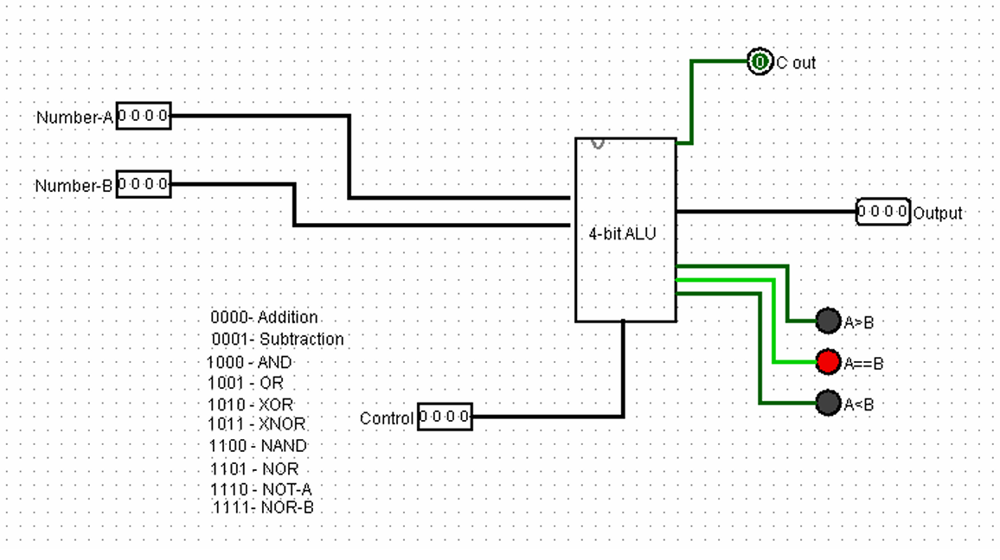

# ALU Design – ECE Assignment

This repository contains the Verilog-based implementation of a simple **Arithmetic Logic Unit (ALU)** designed as part of the Embedded Systems and Circuits (ESC) coursework.



## 📚 Project Description

The ALU is capable of performing a range of arithmetic and logic operations on 4-bit, 8-bit, or 32-bit inputs (based on your design). It was designed using **Verilog HDL** and tested on simulation tools such as **ModelSim** or **Vivado**. Additionally, Logisim circuit files are included for visual simulation.

### 🧠 Features

- Performs arithmetic operations: `ADD`, `SUB`, `INC`, `DEC`
- Performs logical operations: `AND`, `OR`, `XOR`, `NOT`
- Supports comparison: `Zero`, `Negative`, `Carry`, `Overflow` flags
- Modular design with clean and reusable code
- Testbench for verifying all operations
- Logisim circuit files for 4-bit, 8-bit, and 32-bit ALU designs

## 📁 File Structure

```bash
Logisim/
├── 32-bit ALU.circ       # Logisim circuit for 32-bit ALU
├── 4-bit ALU-1.circ      # Logisim circuit for an alternate 4-bit ALU design
├── 4-BIT ALU.circ        # Logisim circuit for 4-bit ALU
├── 4-bit ALU.pdf         # Documentation for 4-bit ALU
├── 8-bit ALU.circ        # Logisim circuit for 8-bit ALU
├── ALU.circ              # Logisim circuit for general ALU
├── jre-8u441-windows-x64.exe # Java Runtime Environment for Logisim
├── logisim-win-2.7.1.exe # Logisim executable
├── README.md             # Project documentation
└── LICENSE               # License file
```

## 🛠️ Technologies Used

- Verilog HDL
- ModelSim / Vivado (for simulation)
- GTKWave (for waveform viewing)
- Logisim (for circuit simulation)
- Git & GitHub

## 🚀 Getting Started

1. **Clone the repository**
   ```bash
   git clone https://github.com/yourusername/alu-esc-assignment.git
   cd alu-esc-assignment
   ```

2. **Simulate Verilog Code**
   - Open `alu_tb.v` in ModelSim/Vivado
   - Compile all files in `src/` and `tb/`
   - Run simulation and view the waveform

3. **Simulate Logisim Circuits**
   - Install Java Runtime Environment (`jre-8u441-windows-x64.exe`) if not already installed
   - Run `logisim-win-2.7.1.exe`
   - Open any `.circ` file (e.g., `4-BIT ALU.circ`) in Logisim
   - Simulate the circuit and verify its behavior

4. **Modify**
   - Add new operations by extending the `alu.v` logic or updating the Logisim circuits
   - Re-run simulations to verify changes

## ✅ Outputs

Sample waveform result:


Testbench results show correct behavior for all supported operations.

## 📄 License

This project is licensed under the MIT License. See the [LICENSE](LICENSE) file for details.


---

> Feel free to fork this repo and improve the ALU with pipelining, signed operations, or integration with a CPU core.

---

### ✅ `.gitignore` (for Verilog projects)
```gitignore
*.log
*.vcd
*.wlf
*.bak
*.jou
*.pb
*.xml
*.xpr
*.bit
*.mem
.sim/
.simv
.vscode/
```

---

### ✅ `LICENSE` (MIT – optional but recommended)
```text
MIT License

Copyright (c) 2025 [Your Name]

Permission is hereby granted, free of charge, to any person obtaining a copy...
```